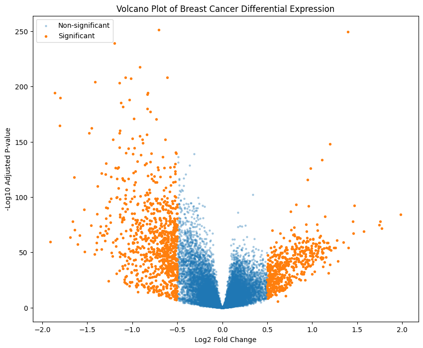
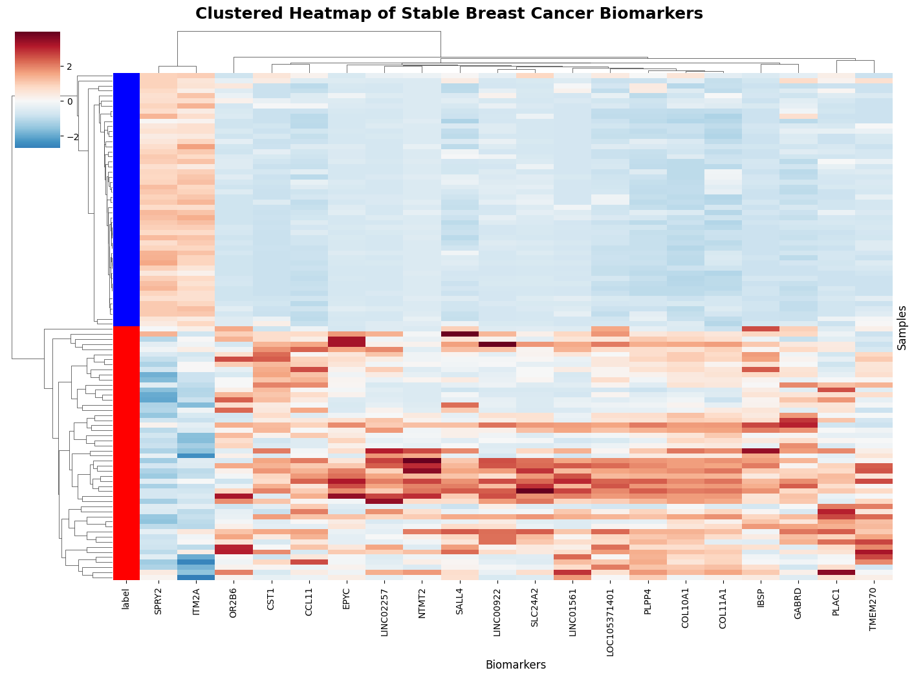
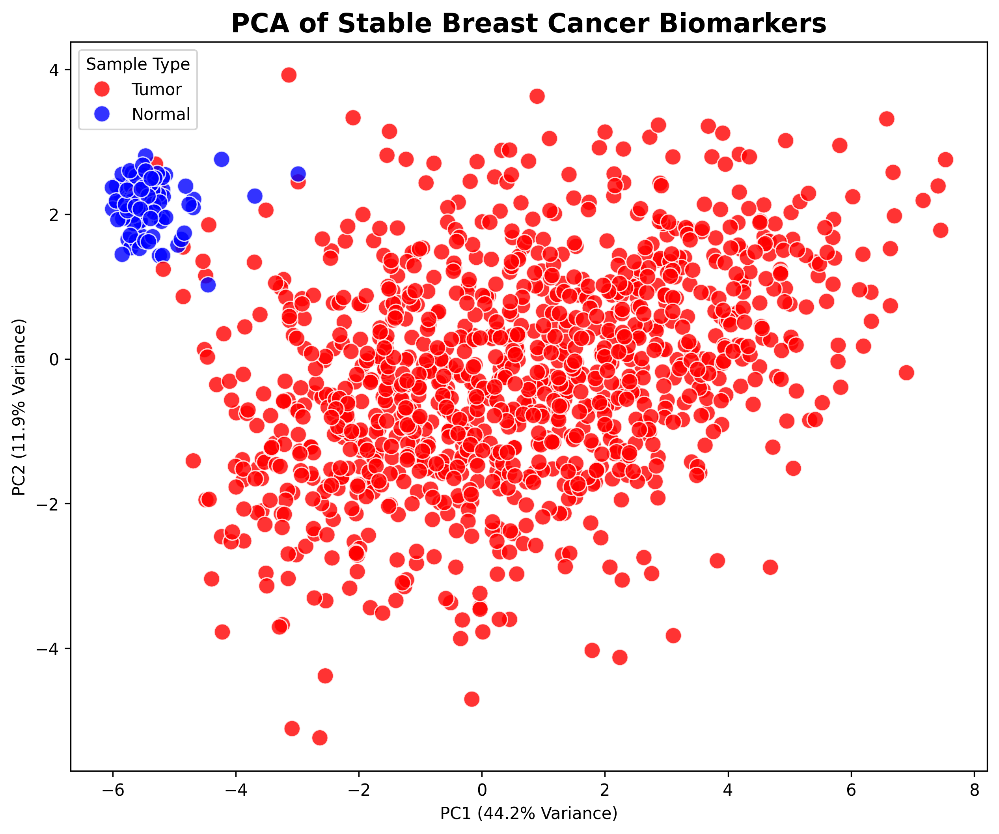
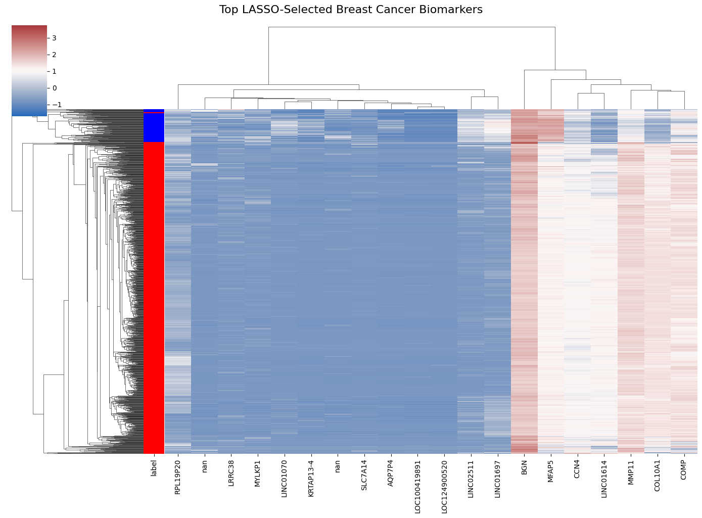
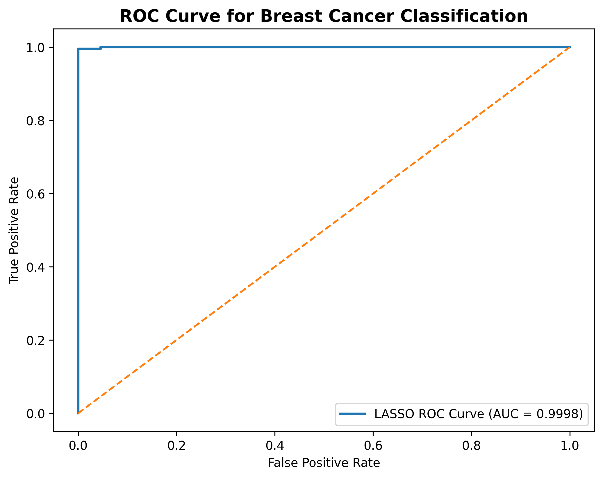

# Genomic Biomarker Discovery for Breast Cancer

## End-to-End Bioinformatics & Leakage-Free Machine Learning Pipeline

This repository presents a transcriptomics and machine learning workflow for identifying stable breast cancer biomarkers using the TCGA Breast Cancer (BRCA) RNA-seq dataset.

The project combines classical differential expression analysis with ltranscriptomic machine learning to identify biologically relevant biomarkers and evaluate tumor-normal transcriptomic separability using RNA-seq data.

---

# Overview

The workflow integrates:

- RNA-seq preprocessing
- Differential gene expression analysis
-  machine learning
- LASSO-based biomarker discovery
- KEGG pathway enrichment
- PCA and clustered heatmap visualization

---

# Dataset

## Source
- TCGA Breast Cancer (BRCA)

## Data Used
- RNA-seq TPM gene expression matrix
- Clinical metadata

## Dataset Scale
- ~60,000 genes
- ~1,200 patient samples

---

# Tech Stack

## Bioinformatics
- DESeq2
- GSEApy
- KEGG
- Bioconductor

## Machine Learning
- Scikit-learn
- Logistic Regression
- LASSO Regression
- Random Forest

## Data Processing
- Pandas
- NumPy
- SciPy

## Visualization
- Matplotlib
- Seaborn
- Plotly

## Environment
- Google Colab
- GitHub

---

# Pipeline Architecture

```text
TCGA RNA-seq Data
        │
        ▼
Data Cleaning & Normalization
        │
        ▼
Tumor vs Normal Labeling
        │
        ├──────────────────────┐
        ▼                      ▼
Differential Expression     Baseline ML Validation
Analysis                    (All Genes)
        │                      │
        ▼                      ▼
Stable Biomarker         LASSO Biomarker Discovery
Selection                     │
        └──────────┬──────────┘
                   ▼
        Pathway Enrichment Analysis
                   │
                   ▼
         PCA & Heatmap Visualization
```

---

# Machine Learning Pipeline

## Models Evaluated
- Logistic Regression
- LASSO Regression
- Random Forest

## Validation Strategy
- Stratified 5-Fold Cross Validation
- Fold-wise DEG analysis
- Train-only feature selection
- ROC-AUC evaluation
- Permutation testing

---

# Baseline Transcriptomic Validation

A separate baseline modeling workflow was developed using the complete RNA-seq transcriptome without prior feature selection or DEG filtering.

Using TCGA barcode-derived tumor/normal labels and  stratified cross-validation:

- Logistic Regression
- LASSO Regression
- Random Forest

all demonstrated near-perfect tumor-normal separation across the transcriptomic expression matrix.

This validated that the observed classification performance was driven by robust biological signal rather than aggressive feature engineering or information leakage.

---

# Results

# Visualizations

## Differential Expression Volcano Plot


## Stable Biomarker Heatmap


## PCA of Transcriptomic Biomarkers


## LASSO Biomarker Heatmap


## LASSO ROC Curve


---

# ML Pipeline Results

| Model | Mean Accuracy | Mean ROC-AUC |
|---|---|---|
| Logistic Regression | 99.4% | 0.9994 |
| LASSO Regression | 99.5% | 0.9997 |
| Random Forest | 99.3% | 0.9993 |

Permutation testing confirmed statistically significant classification performance (p ≈ 0.01), supporting that the identified transcriptomic signal was biologically meaningful rather than random.

---

# Baseline Transcriptomic Validation Results

Using the complete RNA-seq transcriptome without prior feature selection:

| Model | Mean Accuracy | Mean ROC-AUC |
|---|---|---|
| Logistic Regression | 98.3% | 0.9994 |
| LASSO Regression | 99.6% | 0.9997 |
| Random Forest | 98.8% | 0.9990 |

These results demonstrated strong transcriptomic separability between tumor and normal tissue samples independent of differential expression-based feature engineering.

---

# Biomarker Discovery

To prevent information leakage:

- DEG analysis was performed independently within each training fold
- Biomarkers were selected fold-wise
- Stable biomarkers were identified across stratified cross-validation folds

LASSO regularization further reduced the transcriptomic feature space into a sparse and biologically interpretable biomarker panel associated with breast cancer status.

---

# Biological Interpretation

Several stable biomarkers identified across cross-validation folds are associated with known cancer-related biological processes:

- **COL11A1** — extracellular matrix remodeling and tumor invasion
- **CST1** — tumor progression and epithelial dysregulation
- **PLAC1** — tumor growth and cancer-associated proliferation
- **SPRY2** — MAPK/EGFR signaling dysregulation

The clustered heatmaps demonstrated strong transcriptomic separation between tumor and normal tissue samples using both statistically significant DEGs and sparse LASSO-selected biomarkers.

The PCA visualization further showed:

- tight clustering of normal tissue samples
- broader tumor heterogeneity consistent with breast cancer transcriptomic diversity

---

# Notebook Structure

| Notebook | Purpose |
|---|---|
| `1_ingestion&Preprocessing.ipynb` | TCGA data ingestion, preprocessing, normalization, and label generation |
| `2_differential_expression.ipynb` | Differential expression analysis and transcriptomic dysregulation |
| `3_ml_modeling_&Visualization.ipynb` | Leakage-aware machine learning and biomarker discovery |
| `4_baseline_transcriptomic_validation.ipynb` | Baseline transcriptomic validation using all genes without prior feature selection |

---

# Future Improvements

- External validation using GEO cohorts
- Survival analysis using clinical metadata
- Multi-omics integration
- SHAP-based interpretability
- Streamlit deployment
- MLflow experiment tracking
- GCP Vertex AI integration